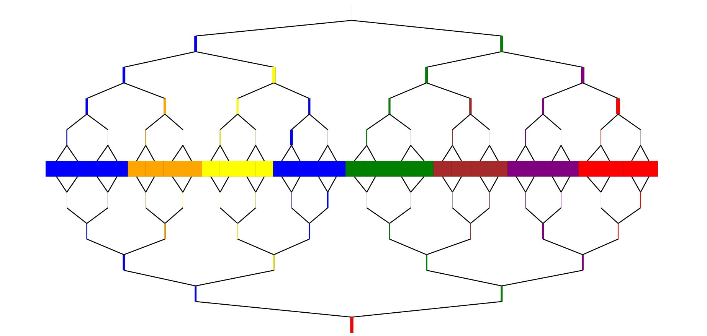
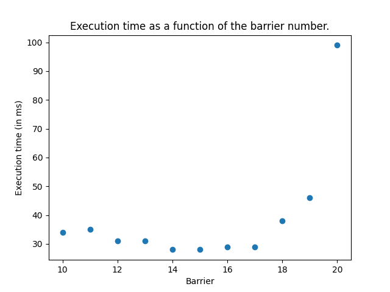
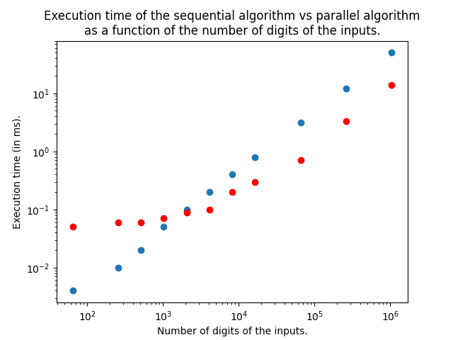

# Adding two binary numbers

## Design decision

Because this project is focused on code parallelization, I chose to implement a
"simpler" version of binary add : I chose to only add binary numbers of 
equal lengths. If we need to add binary numbers of differents length, we simply
pad the smaller one with 0s.

Similarly, the algorithm also returns a result of the same size as the inputs, but
returns a `carry` boolean.

The sequential and parallel algorithms take as input vectors of boolean which are
reversed (lower bit weight at the lowers indices). 
If we want to add binaries as string, we use the `cast_binary` function 
and reverse the result.

## Sequential code

* To compute the sum we zip the iterators made from the two vectors.
* Then we fold them into a new vector and a carry, which will be the returned value.
* In the fold function we set the current carry and the current bit through arithmetics.

```rust
fn add_binary_seq(b1: &Vec<bool>, b2: &Vec<bool>) -> (bool, Vec<bool>) {
    return b1.iter().zip(b2.iter()).fold((false, vec![]), |mut acc, curr| {
        let carry = acc.0;
        acc.0 = (carry as u8 + *curr.0 as u8 + *curr.1 as u8) > 1;
        acc.1.push(((carry as u8 + *curr.0 as u8 + *curr.1 as u8)%2) == 1);
        acc
    });
}
```

## Parallel code

### When to parallelize

To know if we should parallelize the computation, the function asks for a `barrier` parameter.
This value is the power of 2 of the bound for parallelizing. We only parallelize if
the numbers we are trying to add are greater than the bound. If they are not, we switch to sequential.

```rust
    let b1len = b1.len();
    let b2len = b2.len();

    // PARALLEL
    if b1len >= 1<<barrier && b2len >= 1<<barrier {
        // ...
    }
    // SEQUENTIAL
    return add_binary_seq(&b1, &b2);
```

### Splitting the inputs

If we do parallelize, we simply cut the two vectors in the middle,
and then call the parallel function again on the two parts.

```rust
    let (b1g, b1d) = b1.split_at(b1len/2);
    let (b2g, b2d) = b2.split_at(b2len/2);

    // splitting in two parts
    let ((c1, mut r1), (c2, r2)) = rayon::join(
        || add_binary_par(&b1g.to_vec(), &b2g.to_vec(), barrier),
        || add_binary_par(&b1d.to_vec(), &b2d.to_vec(), barrier)
    );
```

### Joining the results

The results are *two vectors* and *two carries*. Because the right part might have
overflown, we need to add its carry to the right part. For this, we use the `add_carry`
function.  
We finally concatenate the two vectors before returning.

```rust
    // merging of the results
    let (c3, mut r3) = add_carry(r2, c1);
    r1.append(&mut r3);

    return (c2 || c3, r1);
```

> The `add_carry` function simply loop over the vector and adds the carry until it finds a 0.
Because we expect binary numbers to rarely be a sequence of 1, this function should return
very quickly and be `O(1)`, but it can reach `O(n)` in a very bad case.

```rust
fn add_carry(mut binary: Vec<bool>, carry: bool) -> (bool, Vec<bool>) {
    // add the carry (can be 0) to the binary
    // since the number are random, and thus having early 0s,
    // this algorithm should be O(1)
    if !carry {
        return (false, binary);
    }
    for i in 0..binary.len() {
        binary[i] = !binary[i];
        if binary[i] {
            return (false, binary);
        }
    }
    return (true, binary);
}
```

## Analysis

### Trace

* Number of digits : 2^20.
* Parallel barrier : 2^17.
	* => Number of workers : 8.
* Execution time (without the tracing) : 42ms.



We can see that most of the computation heavy work is done by different workers,
which may be in parallel. This shows that the parallelism is quite good.

### Execution time

The execution time is measured with the crate `timeit`.

#### As a function of the barrier number

We *add two 2^20 digits binary numbers* together.
We try different values of the barrier ; from 20 (sequential) to 10 (1024 workers).
In every run, `timeit` measured the time of 10 times the function call.



It seems that there is a sweat spot betwen 17 and 16 <=> between 8 and 16 workers.
This seems to make sense because my laptop has 4 cores x 2.

#### Against the sequential code

Now that we know the best value for the barrier, we can compare the execution 
time of the parallel code with the sequential code.
We set the `barrier` number so that there are 8 workers.
We ask `timeit` to call the function 1000 times.



* We can see that for small values, the sequential code is faster.
* We can see that for big values, the parallel code is faster.
* The transition seems to be between 1024 and 2048 digits.
* At the limit, the parallel code is around 3x faster than the sequential code.

Here are the values I measured :
```python
seq = [0.004, 0.01, 0.02, 0.05, 0.1,  0.2, 0.4, 0.8, 3.1, 12,  50]
par = [0.05,  0.06, 0.06, 0.07, 0.09, 0.1, 0.2, 0.3, 0.7, 3.3, 14]
```

